<h4>Australia</h4>
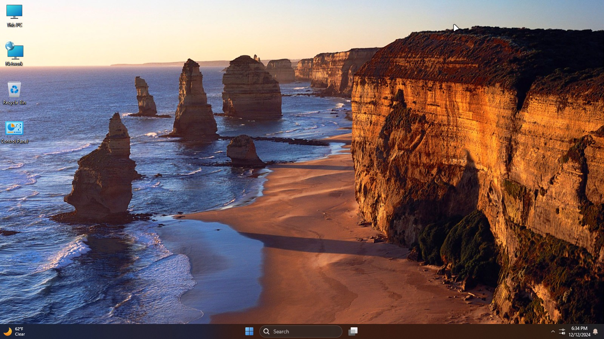
<h4>Brazil</h4>

<h4>Canada</h4>
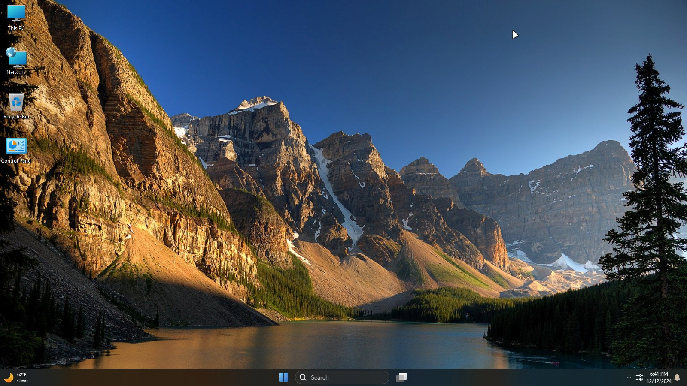
<h4>China</h4>

<h4>France</h4>
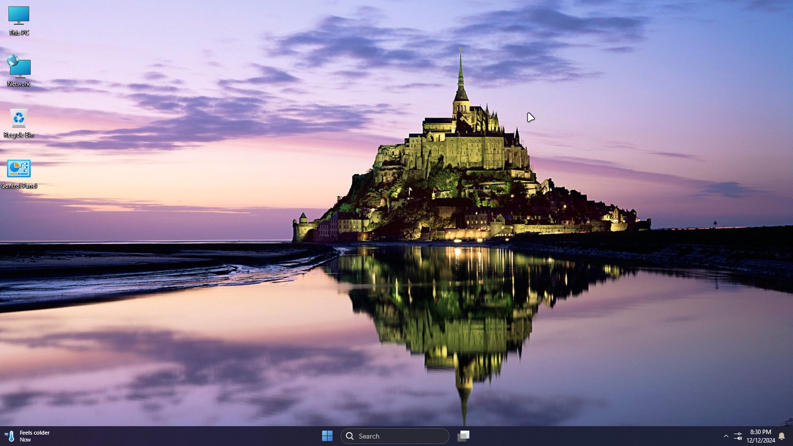
<h4>Germany</h4>
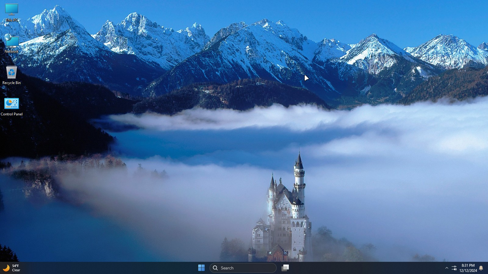
<h4>India</h4>
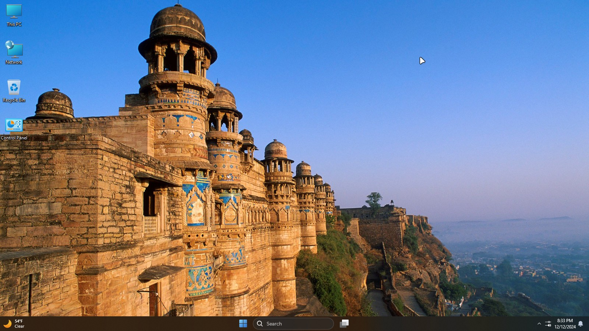
<h4>Italy</h4>
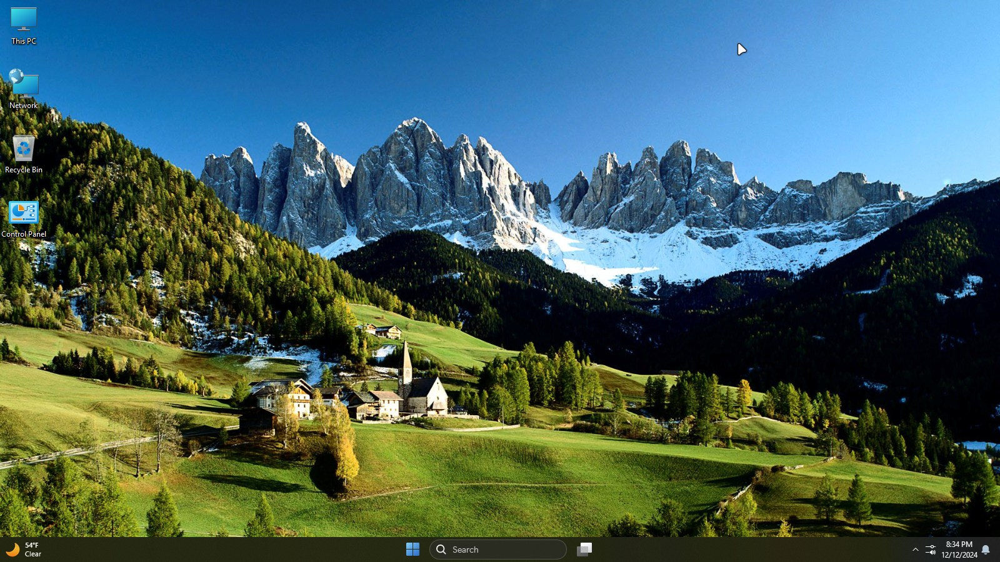
<h4>Japan</h4>

<h4>Korea</h4>
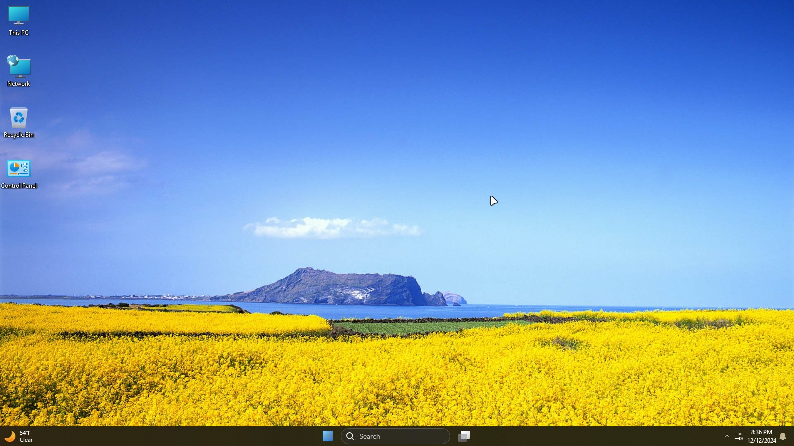
<h4>Mexico</h4>
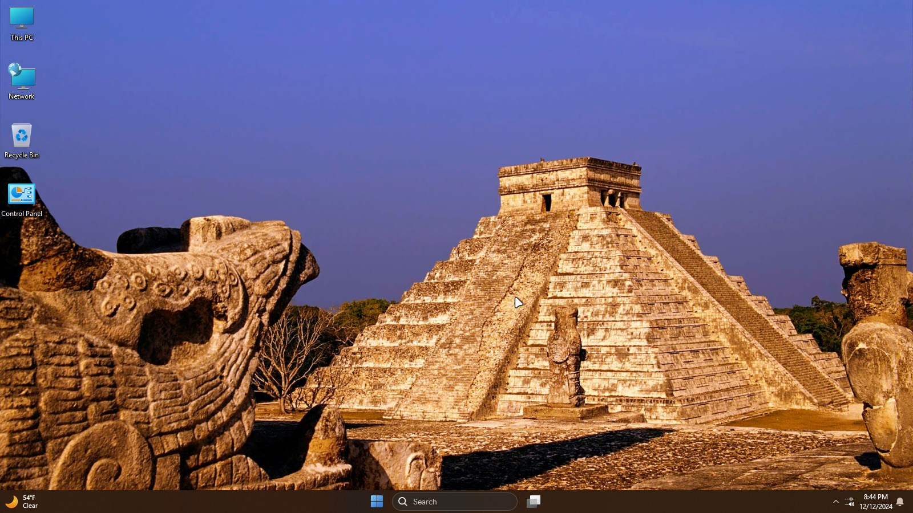
<h4>Poland</h4>

<h4>Russia</h4>
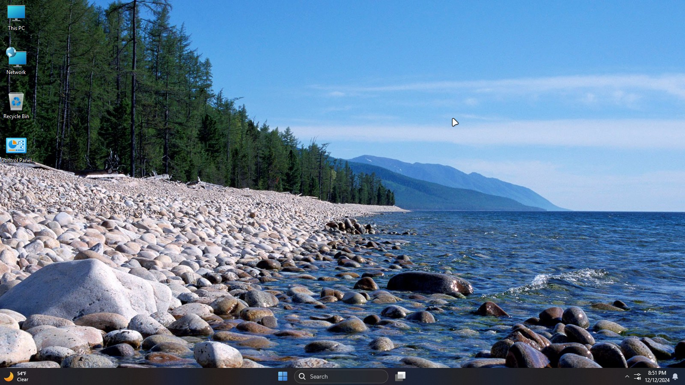
<h4>South Africa</h4>

<h4>Spain</h4>
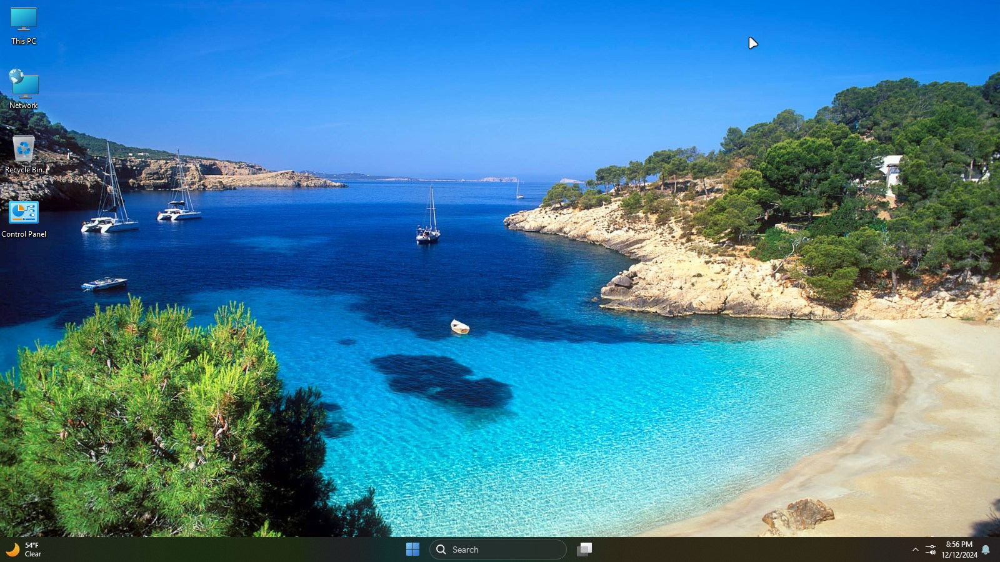
<h4>Taiwan</h4>
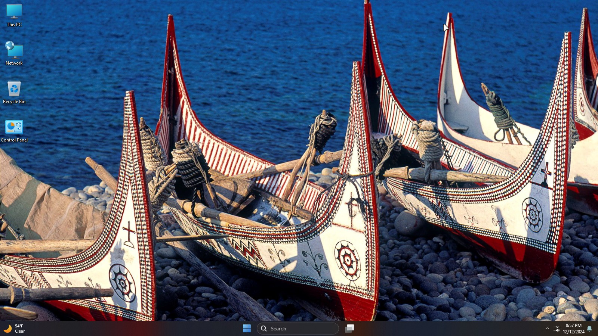
<h4>United Kingdoms</h4>

<h4>United States</h4>

